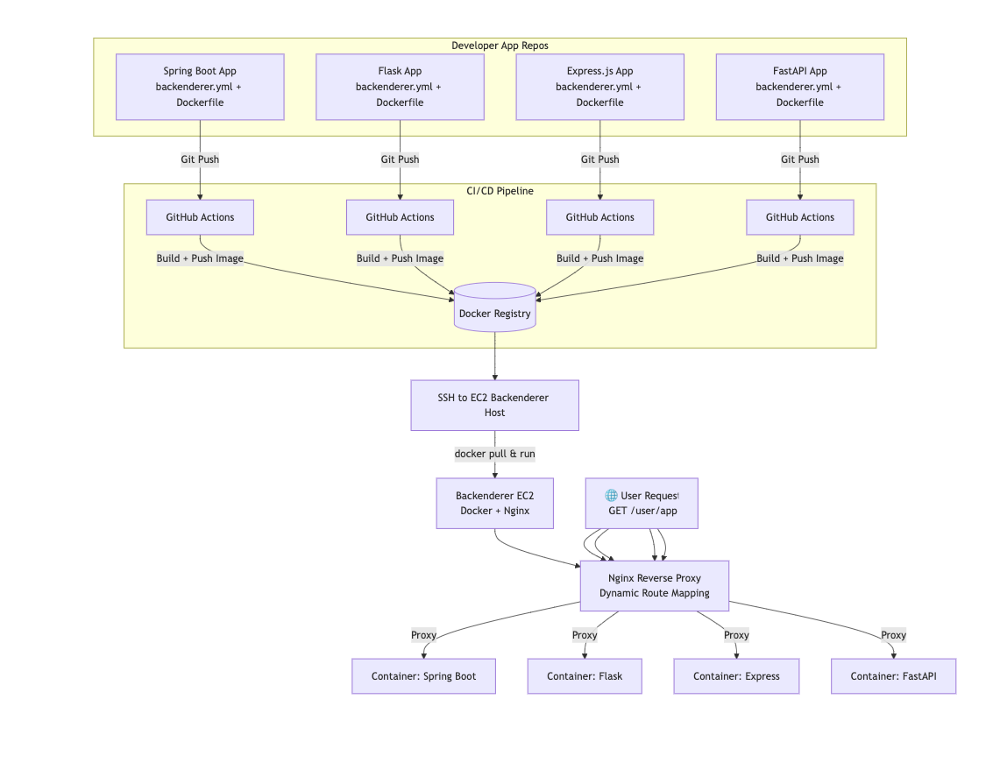

# backenderer -- Backend Platform with AWS and Terraform 


Welcome to the Backenderer Platform! This platform enables users to deploy, manage, and monitor their backend applications seamlessly, with support for scalable infrastructure, dynamic API endpoints, and extensibility for various backend frameworks like Spring Boot, Flask, and more.

---

## **Features**

- **Dynamic API Endpoints**: 
  - Provides endpoints for each user's backend application (e.g., `https://api.yourplatform.com/{user}/{app}`).
  
- **Backend Hosting**:
  - Supports containerized deployments with AWS ECS (Fargate) and traditional server-based hosting with AWS EC2.
    
- **Scalability**:
  - Auto-scaling based on traffic with AWS ALB and ECS auto-scaling groups.
    
- **Infrastructure as Code (IaC)**:
  - Automated provisioning of infrastructure using Terraform.
    
- **Monitoring and Logging**:
  - Real-time performance metrics and centralized logs with AWS CloudWatch, Prometheus, and Grafana.
    
- **Secure Communication**:
  - HTTPS endpoints with API Gateway and authentication via API Keys, OAuth2, or JWT.
    
- **Extensibility**:
  - Modular framework support, starting with Spring Boot and scalable to other frameworks like Flask, Django, etc.

---

## **Architecture Overview**


**Core Components:**
1. **API Gateway**: Dynamic routing for backend applications.
2. **Load Balancer (AWS ALB)**: Distributes traffic to backend services.
3. **Backend Hosting**: ECS (Fargate) for containerized apps and EC2 for traditional apps.
4. **Networking**: VPC, Route 53 for DNS, and Security Groups.
5. **Data Layer**: RDS (PostgreSQL/MySQL), DynamoDB for NoSQL, and S3 for storage.
6. **Monitoring**: AWS CloudWatch, Prometheus, Grafana, and ELK stack.
7. **Automation**: Terraform for IaC, AWS CodePipeline for CI/CD.

---

## **Prerequisites**

1. **Terraform**:
   - Install Terraform: [Terraform Installation Guide](https://developer.hashicorp.com/terraform/tutorials/aws-get-started/install-cli)
2. **AWS CLI**:
   - Install AWS CLI: [AWS CLI Installation Guide](https://aws.amazon.com/cli/)
   - Configure AWS CLI:
     ```bash
     aws configure
     ```
3. **Docker**:
   - Install Docker: [Docker Installation Guide](https://docs.docker.com/get-docker/)
4. **Node.js (Optional for CLI)**:
   - Install Node.js for CLI interactions: [Node.js Download](https://nodejs.org/)

---

## **Setup Instructions**

### 1. Clone the Repository
```bash
git clone https://github.com/yourusername/backend-platform.git
cd backend-platform
```

### 2. Configure Environment Variables
Create a `.env` file in the project root and configure the following:
```env
AWS_REGION=us-east-1
AWS_ACCOUNT_ID=<your-aws-account-id>
API_GATEWAY_DOMAIN=api.yourplatform.com
DOCKER_REGISTRY=your-docker-repo
```

### 3. Initialize Terraform
```bash
cd terraform
terraform init
```

### 4. Provision Infrastructure
```bash
terraform apply
```
_Confirm the infrastructure changes when prompted._

### 5. Build and Deploy Sample Application
#### Build Docker Image
```bash
cd sample-apps/spring-boot-app
docker build -t your-docker-repo/spring-boot-app:latest .
```

#### Push Docker Image to ECR
```bash
docker push your-docker-repo/spring-boot-app:latest
```

#### Deploy Application
- Use the CLI tool or Web Dashboard to deploy the application:
```bash
myplatform deploy --app spring-boot-app --env production
```

---

## **Usage**

### Deploy a Backend Application
1. Upload the application or connect your Git repository via the Web Dashboard.
2. Specify application settings (framework, environment variables, database).
3. Deploy the application.

### Access Application Endpoint
- After deployment, the platform provides a unique endpoint for your application:
  ```plaintext
  https://api.yourplatform.com/{user}/{app}
  ```
- Use this endpoint to access your application’s APIs.

### Monitor Application
- View performance metrics and logs in the Web Dashboard.
- Access detailed dashboards in Grafana or CloudWatch.

---

## **Roadmap**

1. **Multi-Framework Support**:
   - Add adapters for Flask, Django, and Express.
2. **Serverless Support**:
   - Add support for AWS Lambda deployments.
3. **Enhanced Monitoring**:
   - Integrate AI-driven anomaly detection for performance.
4. **Multi-Cloud Support**:
   - Extend platform compatibility to GCP and Azure.

Proposed project design look like this; 



---

---

## **License**

This project is licensed under the MIT License. See the [LICENSE](./LICENSE) file for details.

---
